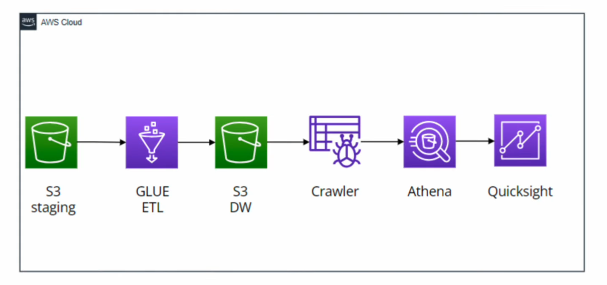

# 🎵 Spotify AWS Data Pipeline 🚀

## 📌 Overview
This project extracts, transforms, and loads (ETL) **Spotify streaming data** using AWS services.  
The goal is to **analyze user listening patterns** and generate insights using **AWS Glue, S3, Athena, and Quicksight**.

## 🏗️ Architecture

(Full AWS pipeline diagram)

1️⃣ **Spotify Data Extraction** → Extracts raw data from Spotify API  
2️⃣ **AWS Glue ETL** → Cleans and transforms the data  
3️⃣ **S3 Data Warehouse** → Stores processed data  
4️⃣ **AWS Glue Crawler** → Creates metadata tables  
5️⃣ **Athena Queries** → SQL-based analysis  
6️⃣ **Amazon Quicksight** → Data visualization  

## 📦 Tech Stack
- **AWS Services**: Glue, S3, Athena, Quicksight  
- **Programming**: Python, SQL  
- **Data Processing**: Pandas, PySpark  
- **Infrastructure**: Terraform
